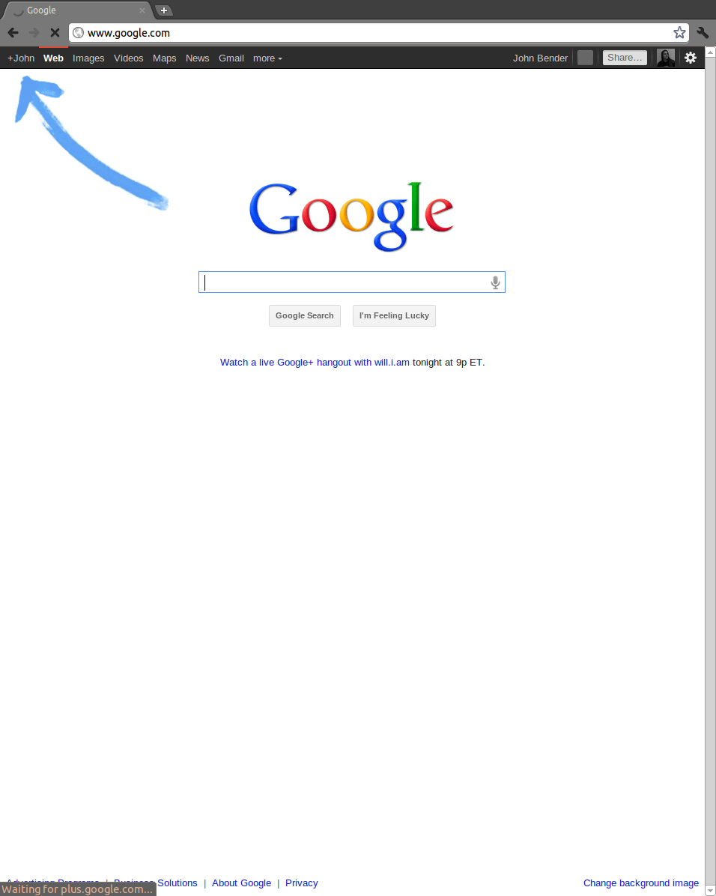
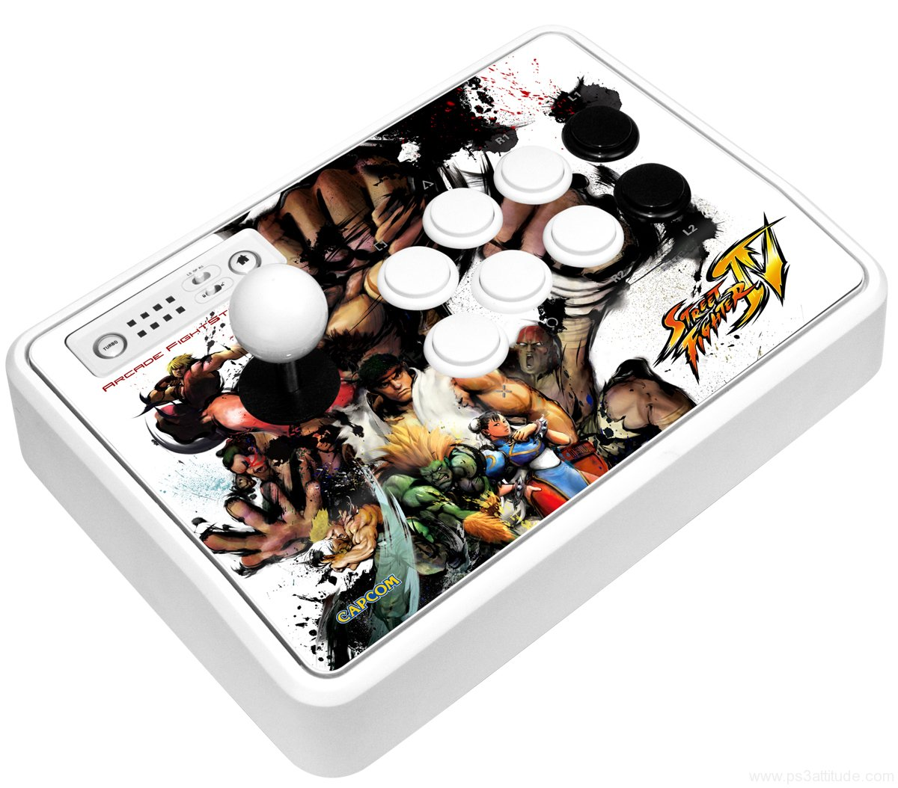

!SLIDE
# native vs mobile web
</img>

!SLIDE
# native
</img>

!SLIDE
## the good
</img>

!SLIDE
### experience

!SLIDE
### speed

!SLIDE
### distribution

!SLIDE
### dev tools

!SLIDE
## the bad
</img>

!SLIDE
### overhead

!SLIDE
### fragmentation

!SLIDE
### skillsets

!SLIDE
# web
</img>

!SLIDE
## disclaimer
</img>

!SLIDE
## the good
</img>

!SLIDE
### single environment

!SLIDE
### large developer pool

!SLIDE
### web built-in

!SLIDE
### updates

!SLIDE
### familiar tools

!SLIDE
## the bad
</img>

!SLIDE
### slow

!SLIDE
### second class

!SLIDE
## browser quirks

!SLIDE
### replaceState
</img>

!SLIDE
### pushState
</img>

!SLIDE
### anti-aliasing
</img>

!SLIDE
### select menus
</img>

!SLIDE
### hardware accel
</img>

!SLIDE
# when?

!SLIDE
## native
</img>

!SLIDE
### games (?)
</img>

!SLIDE
### lots of money
</img>

!SLIDE
### existing experience

!SLIDE
### no server

!SLIDE
## web
</img>

!SLIDE
### short timescale

!SLIDEp
### existing application

!SLIDE
### web experience
